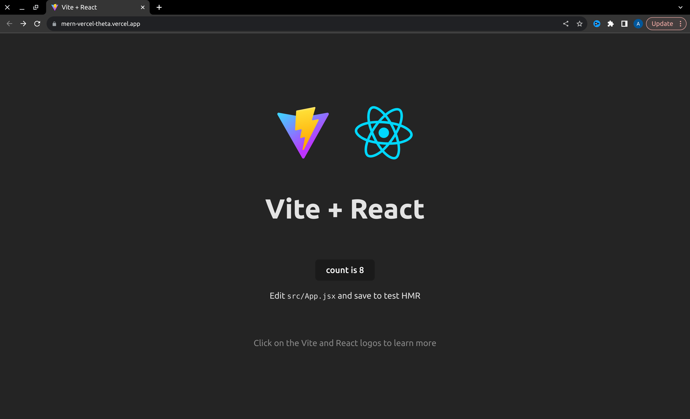
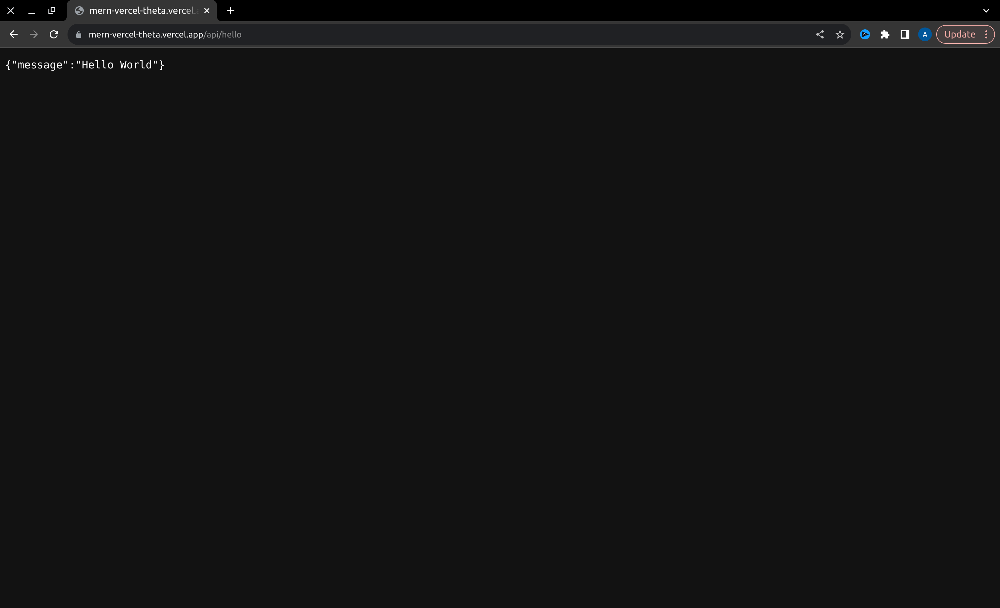

<p align="center">
  <p align="center">
    <a href="https://www.youtube.com/@codingforinnovations" target="_blank">
          
    </a>
  </p>
  <p align="center">
    For Programmers, By Programmers.
  </p>
</p>

# MERN Stack in Vercel

Deploy a MERN Stack to Vercel.

### Youtube Video: [Link](https://www.youtube.com/watch?v=GyDAGGUn3Ck)

### Instant Deploy to Vercel:

[](https://vercel.com/new/clone?repository-url=https://github.com/codingforinnovations/mern-vercel)

## 📚 Stack:

- [Vercel](https://vercel.com/) - Frontend Cloud gives developers the frameworks, workflows, and infrastructure to build a faster, more personalized Web.
- [React](https://react.dev/) - The library for web and native user interfaces.
- [Vite](https://vitejs.dev/) - Next Generation Frontend Tooling.
- [Express](https://expressjs.com/) - Fast, opinionated, minimalist web framework for Node.js.

## 📸 Screenshots:
- Frontend:
 

- Backend:
 


## 📁 Project structure:

```
$PROJECT_ROOT
│  
├── api/  # Express Backend
│  
├── client/  # React app
│
├── vercel.json # vercel json file
```


##  🏆Getting Started: 

- Clone repository 

```bash
mkdir ~/Dev/mern-react -p
cd ~/Dev/mern-react
git clone https://github.com/codingforinnovations/mern-vercel.git .
```  

- Start Express Js:
```bash
cd ~/Dev/mern-react/api
npm i
npm run dev
```

- Start React app:

```bash
cd ~/Dev/mern-react/client/
npm i
npm run dev
```


Open [localhost:8000/api/hello](http://localhost:8000/admin) in your browser for api!

Open [localhost:3000](http://localhost:3000) in your browser for client


## 🎫 LICENSE:

[MIT LICENSE](https://github.com/codingforinnovations/mern-vercel/blob/main/LICENSE)

## 🆕 Change Log:

[Change Log](https://github.com/codingforinnovations/mern-vercel/commits/main/)

<br />


<div align="center">
<i>Other places you can find us:</i><br>
<a href="https://www.youtube.com/@codingforinnovations" target="_blank"></a>
</div>
